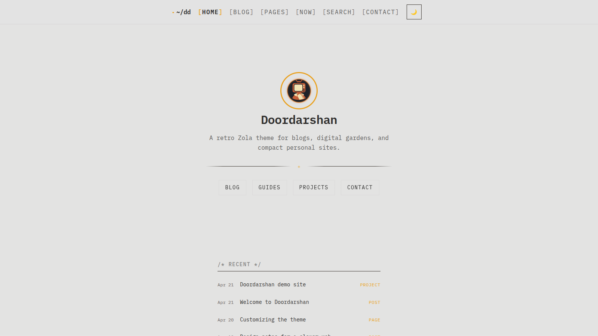

# doordarshan



Doordarshan is a Zola theme for a retro Indian terminal/notebook aesthetic: monospace-heavy typography, warm terracotta accents, compact navigation, and a layout that works for blogs, personal sites, project logs, and small digital gardens.

- Live demo: https://oddship.github.io/doordarshan-zola/
- Theme repository: https://github.com/oddship/doordarshan-zola

## Features

- homepage hero with configurable avatar, title, tagline, and CTA links
- optional recent-updates rail on the homepage
- blog list + archive flow for dated posts
- wiki/garden-style pages area with sidebar navigation
- project-section templates with GitHub/demo/website links and archived status
- theme-owned contact, search, 404, and homepage defaults
- light/dark theme toggle
- RSS, Open Graph, Twitter card, favicon, and JSON-LD metadata defaults
- namespaced config contract under `extra.doordarshan.*`
- compatibility fallbacks for legacy flat keys during migration
- explicit hook for site-owned JavaScript via `extra.doordarshan.scripts.additional`

## Install

### Git submodule

Prefer HTTPS for widest compatibility:

```bash
git submodule add https://github.com/oddship/doordarshan-zola.git themes/doordarshan
```

If you use SSH keys with GitHub, this works too:

```bash
git submodule add git@github.com:oddship/doordarshan-zola.git themes/doordarshan
```

Then in your site `config.toml`:

```toml
theme = "doordarshan"
compile_sass = true
build_search_index = true
```

### Plain clone

```bash
git clone https://github.com/oddship/doordarshan-zola.git themes/doordarshan
```

## Required top-level Zola settings

At minimum, most sites using the theme should set:

```toml
theme = "doordarshan"
compile_sass = true
build_search_index = true
```

Search pages use Zola's generated search index, so `build_search_index = true` is expected when `extra.doordarshan.features.site_search = true`.

## Content model

The theme assumes a small, explicit content topology:

```text
content/
├── _index.md
├── blog/
│   ├── _index.md
│   └── your-posts.md
├── pages/
│   ├── _index.md
│   ├── guides/
│   │   ├── _index.md
│   │   └── page.md
│   └── projects/
│       ├── _index.md
│       └── project.md
├── contact.md
├── search.md
└── now.md           # optional
```

Only two section roots are important to the theme contract:
- `blog/_index.md`
- `pages/_index.md`

You can move them by changing `extra.doordarshan.sections.blog` and `extra.doordarshan.sections.pages`.

## Built-in templates and behaviors

| Route / content type | Template | Notes |
|---|---|---|
| `/` | `templates/index.html` | Theme-owned homepage hero + optional recent items |
| blog section | `templates/section.html` | Standard blog listing |
| blog archive | `templates/blog-archive.html` | Linked from the main blog section |
| generic pages/posts | `templates/page.html` | Supports reading metadata and optional `page.extra.toc` |
| pages root | `templates/pages-list.html` | Garden/wiki index with featured subsections |
| pages subsections | `templates/pages-section.html` | Sidebar layout |
| project sections | `templates/projects-section.html` | Project index with status badges |
| project pages | `templates/projects-page.html` | Supports project links + context block |
| contact page | `templates/contact.html` | Theme-owned; content file can stay thin |
| search page | `templates/search.html` | Theme-owned; language-aware search index loading |
| 404 page | `templates/404.html` | Uses configured section roots for fallback links |
| now page | `templates/now.html` | Optional opinionated now-page template |

## Configuration reference

The preferred config surface is namespaced under `extra.doordarshan`.

### `extra.doordarshan.sections`

| Key | Type | Default | Purpose |
|---|---|---:|---|
| `blog` | string | `"blog/_index.md"` | Source section path for blog content |
| `pages` | string | `"pages/_index.md"` | Source section path for pages/wiki content |

### `extra.doordarshan.features`

| Key | Type | Default | Purpose |
|---|---|---:|---|
| `pages_search` | bool | `true` | Enables sidebar search inside the configured pages section |
| `site_search` | bool | `true` | Enables the standalone `/search/` page |

### `extra.doordarshan.assets`

| Key | Type | Default | Purpose |
|---|---|---:|---|
| `social_image` | string | `""` | Fallback OG/Twitter image path |

### `extra.doordarshan.homepage`

| Key | Type | Default | Purpose |
|---|---|---:|---|
| `show_recent` | bool | `false` | Enables recent content rail on the homepage |
| `recent_limit` | integer | `5` | Number of recent items to show |
| `links` | array | none | CTA links shown in the hero |

`homepage.links` entries use:

```toml
[[extra.doordarshan.homepage.links]]
label = "Blog"
url = "/blog/"
```

### `extra.doordarshan.scripts`

| Key | Type | Default | Purpose |
|---|---|---:|---|
| `additional` | array[string] | `[]` | Site-owned scripts loaded after theme assets |

Use this for clearly site-specific behavior rather than baking it into the theme.

### `extra.doordarshan.contact`

| Key | Type | Default | Purpose |
|---|---|---:|---|
| `intro` | string | `""` | Intro copy for the contact page |
| `email` | string | `""` | Contact email address |
| `response_time` | string | `""` | Small expectations note |
| `links` | array | none | External profile/contact links |

`contact.links` entries use:

```toml
[[extra.doordarshan.contact.links]]
label = "GitHub"
url = "https://github.com/example"
description = "code & projects"
```

### `extra.doordarshan.identity`

| Key | Type | Default | Purpose |
|---|---|---:|---|
| `nav_brand` | string | `""` | Left-side brand label in the header |
| `avatar` | string | `""` | Homepage avatar image path |
| `homepage_title` | string | `""` | Hero title override |
| `homepage_tagline` | string | `""` | Hero subtitle override |
| `handwritten_font` | string | `""` | Optional secondary font stylesheet URL |
| `favicon` | string | `""` | Favicon path |
| `github_url` | string | `""` | GitHub link used in footer + structured data |
| `twitter_handle` | string | `""` | Twitter/X handle for social metadata |

### `extra.doordarshan.analytics`

| Key | Type | Purpose |
|---|---|---|
| `enabled` | bool | Enables analytics injection |
| `script_url` | string | Analytics script URL |
| `website_id` | string | Analytics site ID |

When the namespaced analytics block is present, it is authoritative. If it is absent, the theme can still fall back to legacy `extra.umami` keys.

### `extra.doordarshan.nav.menu`

Navigation items use:

```toml
[[extra.doordarshan.nav.menu]]
name = "Home"
url = "/"
weight = 1
```

## Full example config

```toml
[extra.doordarshan.sections]
blog = "blog/_index.md"
pages = "pages/_index.md"

[extra.doordarshan.features]
pages_search = true
site_search = true

[extra.doordarshan.assets]
social_image = "/images/social-card.png"

[extra.doordarshan.homepage]
show_recent = true
recent_limit = 5

[[extra.doordarshan.homepage.links]]
label = "Blog"
url = "/blog/"

[[extra.doordarshan.homepage.links]]
label = "Projects"
url = "/pages/projects/"

[[extra.doordarshan.homepage.links]]
label = "Contact"
url = "/contact/"

[extra.doordarshan.scripts]
additional = ["js/site-only.js"]

[extra.doordarshan.contact]
intro = "Want to get in touch?"
email = "hello@example.com"
response_time = "Usually within a day or two."

[[extra.doordarshan.contact.links]]
label = "GitHub"
url = "https://github.com/example"
description = "code & projects"

[[extra.doordarshan.contact.links]]
label = "Mastodon"
url = "https://fosstodon.org/@example"
description = "fediverse"

[extra.doordarshan.identity]
nav_brand = "~/site"
avatar = "/images/avatar.svg"
homepage_title = "Your Name"
homepage_tagline = "Short homepage tagline"
handwritten_font = "https://fonts.googleapis.com/css2?family=Shrikhand&display=swap"
favicon = "/images/favicon.ico"
github_url = "https://github.com/example/"
twitter_handle = "@example"

[extra.doordarshan.analytics]
enabled = false
script_url = ""
website_id = ""

[[extra.doordarshan.nav.menu]]
name = "Home"
url = "/"
weight = 1

[[extra.doordarshan.nav.menu]]
name = "Blog"
url = "/blog/"
weight = 2

[[extra.doordarshan.nav.menu]]
name = "Pages"
url = "/pages/"
weight = 3

[[extra.doordarshan.nav.menu]]
name = "Contact"
url = "/contact/"
weight = 4
```

## Page and section frontmatter extras

The theme also recognizes a few useful page/section-level extras.

### Pages and posts

| Key | Used by | Purpose |
|---|---|---|
| `page.extra.toc` | `page.html` | Shows the generated table of contents block |
| `page.extra.og_image` | head metadata | Per-page social card override |

### Project pages

| Key | Used by | Purpose |
|---|---|---|
| `page.extra.status = "archived"` | project page/section templates | Shows archived badge |
| `page.extra.github_url` | project page template | GitHub link |
| `page.extra.demo_url` | project page template | Demo link |
| `page.extra.website_url` | project page template | Website link |
| `page.extra.context` | project page template | Renders a “Why I starred this”/context block |

### Sections

| Key | Used by | Purpose |
|---|---|---|
| `section.extra.featured = true` | pages index/sidebar | Highlights a subsection |
| `section.extra.hidden = true` | pages index/sidebar | Hides a subsection from navigation |
| `section.extra.section_title` | pages sidebar | Overrides sidebar title label |
| `section.extra.og_image` | head metadata | Per-section social card override |

## Customization model

Zola lets you override any file from the theme by shadowing it in your site root.

Examples:

```text
templates/page.html              -> replace theme page template
templates/partials/head.html     -> customize metadata/head markup
static/js/site.js                -> add site-specific behavior
static/images/favicon.ico        -> override theme fallback asset
```

Use config for the first layer of customization, then override individual templates or static files when you need deeper control.

## Sample site and local preview

This repository is also a buildable Zola site used for:
- the GitHub Pages demo
- gallery screenshots
- local theme development

Run it locally with Zola:

```bash
zola serve
```

Build it for production:

```bash
zola build
```

The demo published from `main` is deployed through `.github/workflows/pages.yml`.
That workflow:
- pins the Zola package source
- computes `--base-url` dynamically from the repository URL by default
- accepts a `PAGES_BASE_URL` repository variable for forks or custom domains
- avoids canceling in-progress runs so manual Pages publishes do not show up as failed-looking canceled CI

## Compatibility policy

The theme accepts both:
- namespaced keys under `extra.doordarshan.*`
- legacy flat keys such as `extra.nav_brand`, `extra.menu_main`, `extra.github`, `extra.twitter_handle`, `extra.favicon`, `extra.handwritten_font`, and `extra.umami`

Preference order is:
1. non-empty namespaced values under `extra.doordarshan.*`
2. legacy flat keys
3. theme fallback/default

Analytics is a special case: if `extra.doordarshan.analytics` is present at the site level, it is authoritative, including `enabled = false`. Legacy `extra.umami` is only consulted when the namespaced analytics block is absent.

## Repo layout

```text
config.toml                 sample-site config and Pages demo config
content/                    committed standalone demo content
sass/                       theme styles
static/                     theme assets and JavaScript
templates/                  theme templates
screenshot.png              gallery screenshot for getzola/themes
.github/workflows/pages.yml GitHub Pages deploy for the sample site
```

## License

MIT
